# Procesverslag
Markdown is een simpele manier om HTML te schrijven.  
Markdown cheat cheet: [Hulp bij het schrijven van Markdown](https://github.com/adam-p/markdown-here/wiki/Markdown-Cheatsheet).

Nb. De standaardstructuur en de spartaanse opmaak van de README.md zijn helemaal prima. Het gaat om de inhoud van je procesverslag. Besteedt de tijd voor pracht en praal aan je website.

Nb. Door *open* toe te voegen aan een *details* element kun je deze standaard open zetten. Fijn om dat steeds voor de relevante stuk(ken) te doen.

## Jij

  
uitwerken voor kick-off werkgroep

  ### Auteur:
  Valentijn van Harn

  #### Je startniveau:
  Blauw

  #### Je focus:
  Surface plane
 

## Je website

  
uitwerken voor kick-off werkgroep

  ### Je opdracht:
  https://shotdeck.com/browse/stills#

  #### Screenshot(s) van de eerste pagina (small screen): 
  Browsescherm  
  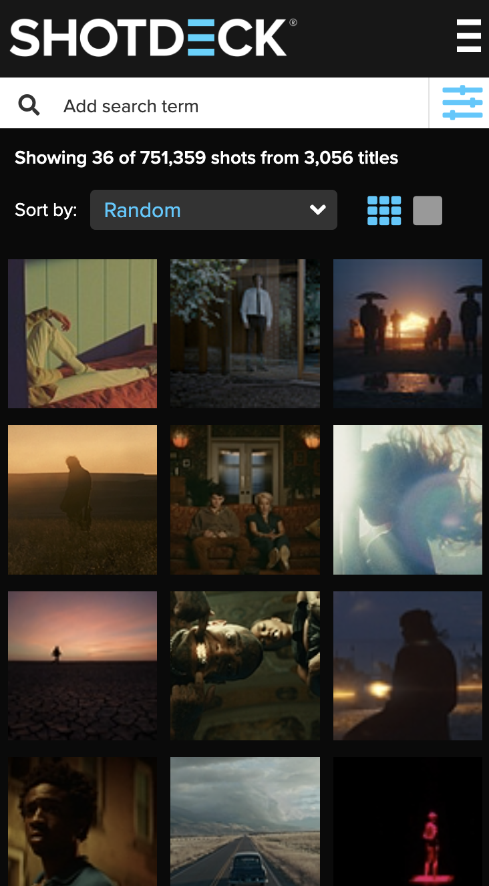
  

  #### Screenshot(s) van de tweede pagina (small screen):
  Shot detailpagina/popup  
  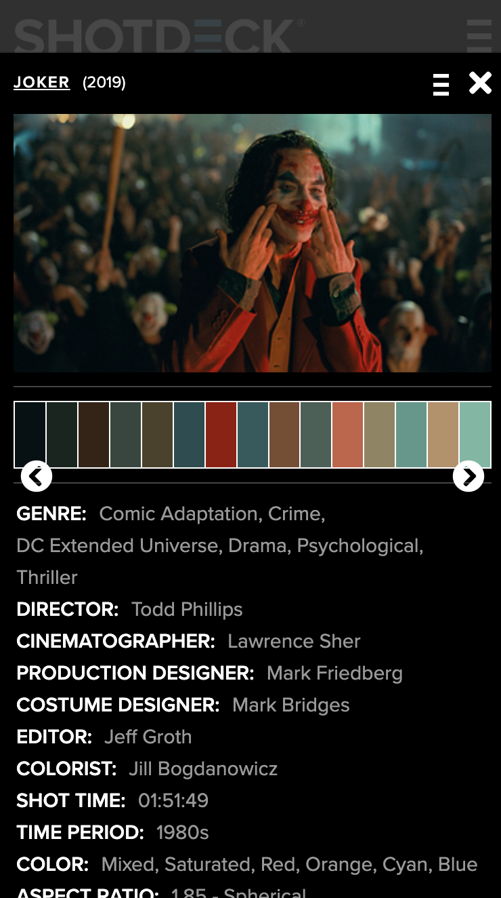
  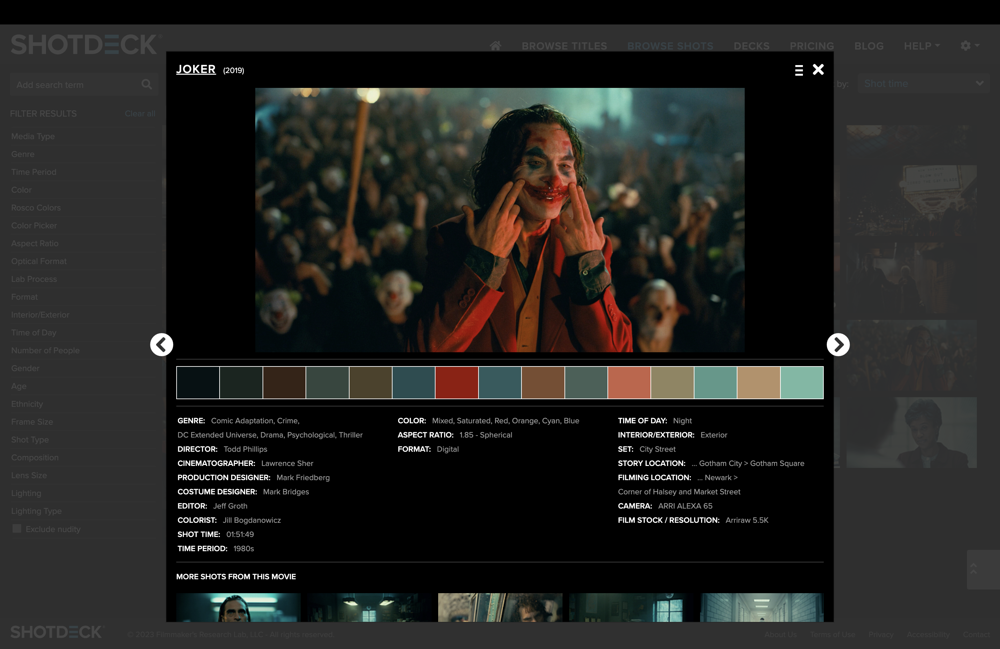

## Toegankelijkheidstest 1/2 (week 1)

  
uitwerken na test in 2e werkgroep

  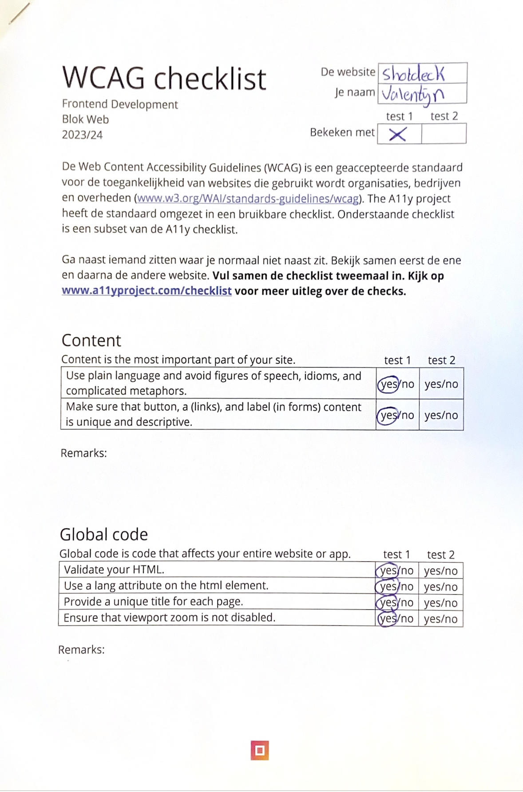
  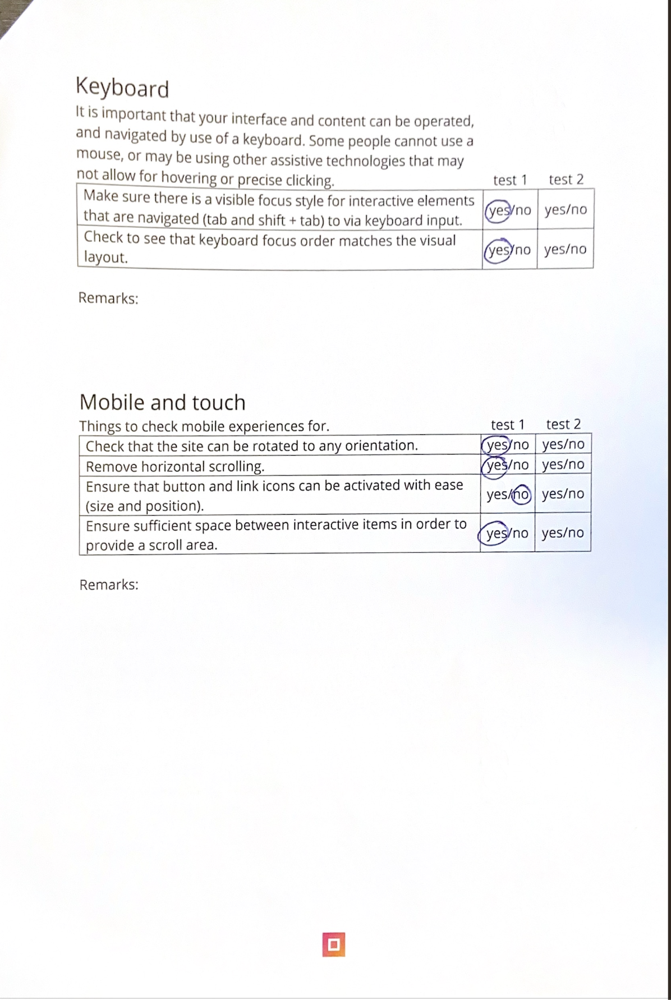
  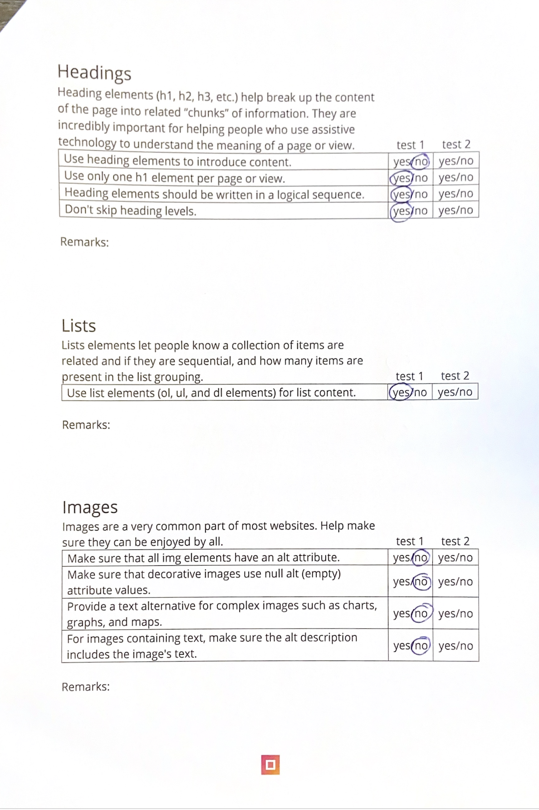
  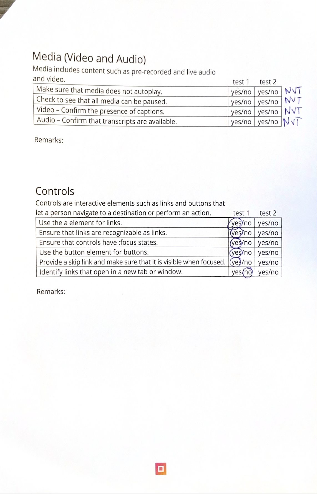
  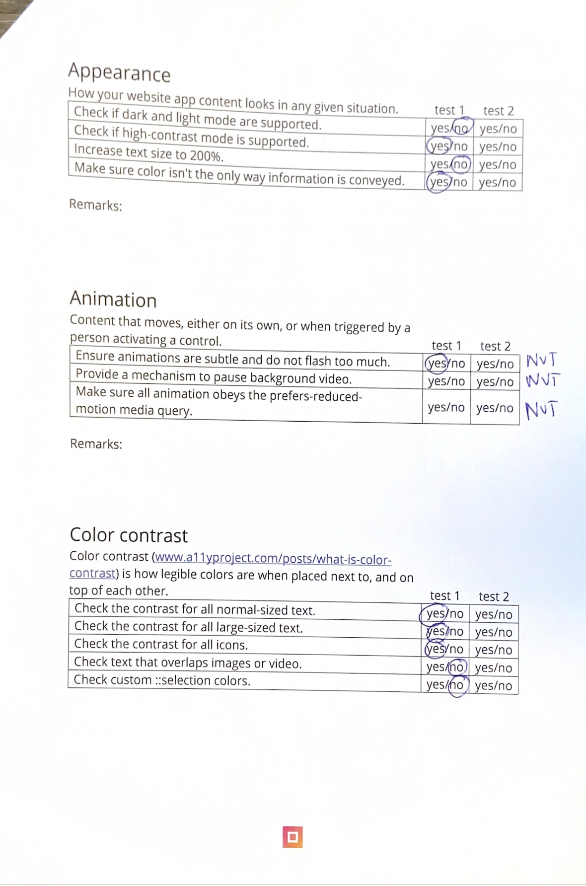

  ### Bevindingen
  Lijst met je bevindingen die in de test naar voren kwamen:

  <ul>
    <li>[MOBILE & TOUCH] Links en buttons staan in sommige gevallen te dicht op elkaar > benadeelt usability.
    </li>
    <li>[HEADINGS] Er worden geen heading elementen gebruikt om content te introduceren.</li>
    <li>[IMAGES] Bijna alle afbeeldingen hebben geen alt attribute > Maakt kern website onbruikbaar voor blinden.
    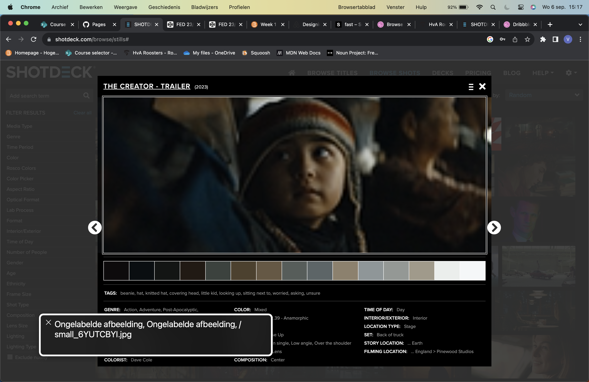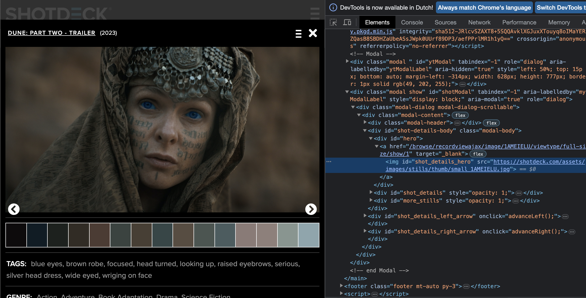</li>
    <li>[APPEARANCE] Light and dark mode is niet supported.</li>
    <li>[APPEARANCE] Tekst kan niet worden vergroot naar 200%.</li>
    <li>[COLOR CONTRAST] Afbeeldingen die overlappen met tekst zijn in sommige gevallen niet goed leesbaar.
    </li>
  </ul>

## Breakdownschets (week 1)

  
uitwerken na afloop 3e werkgroep

  ### de hele pagina: 
  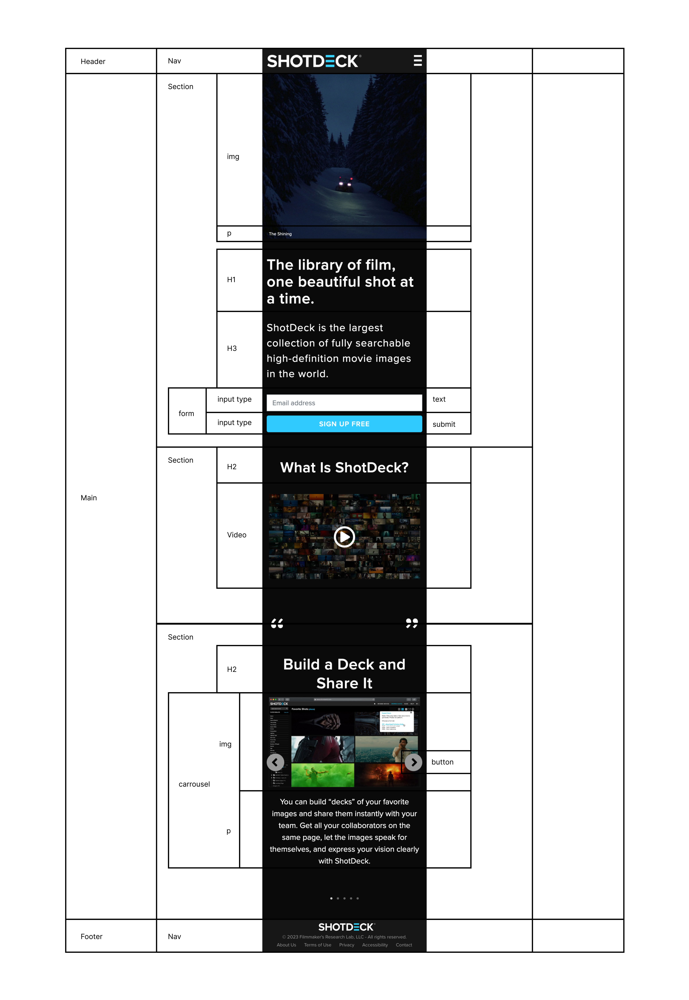

## Voortgang 1 (week 2)

  
uitwerken voor 1e voortgang

  ### Stand van zaken
  hier dit ging goed & dit was lastig (neem ook screenshots op van delen van je website en code)

  ### Agenda voor meeting

  ### Verslag van meeting

## Voortgang 2 (week 3)

  
uitwerken voor 2e voortgang

  ### Stand van zaken
  hier dit ging goed & dit was lastig (neem ook screenshots op van delen van je website en code)

  ### Agenda voor meeting
  samen met je groepje opstellen

  - Mijn order werkt niet. Hoe los ik dit op?
  - Hoe krijg ik tekst over mijn plaatje

  ### Verslag van meeting
  hier na afloop snel de uitkomsten van de meeting vastleggen
  
  - Ik moest order -1 gebruiken binnen een figure
  - Door position relative

## Toegankelijkheidstest 2/2 (week 4)

  
uitwerken na test in 9e werkgroep

  ### Bevindingen
 Uit de tweede toegankelijkheidstest bleek dat veel dingen voor toegankelijkheid zijn verbeterd. Ik heb alleen nog geen high-contrast mode. Maar dat is in mijn geval niet nodig omdat de website van nature al een hoog contrast heeft. 

## Voortgang 3 (week 4)

  
uitwerken voor 3e voortgang

  ### Stand van zaken
  hier dit ging goed & dit was lastig (neem ook screenshots op van delen van je website en code)

  ### Agenda voor meeting
  samen met je groepje opstellen

  ### Verslag van meeting
  hier na afloop snel de uitkomsten van de meeting vastleggen
  

## Eindgesprek (week 5)

  
uitwerken voor eindgesprek

  ### Je uitkomst - karakteristiek screenshots:
  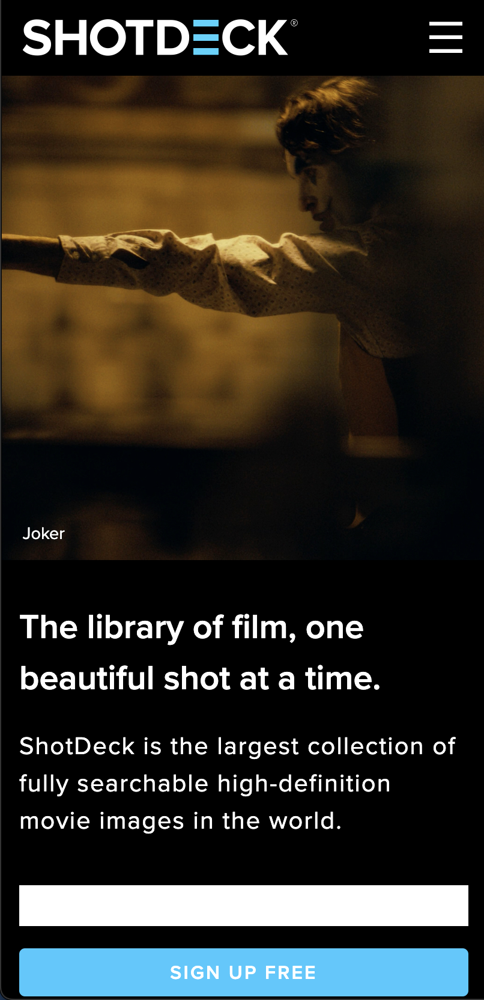
  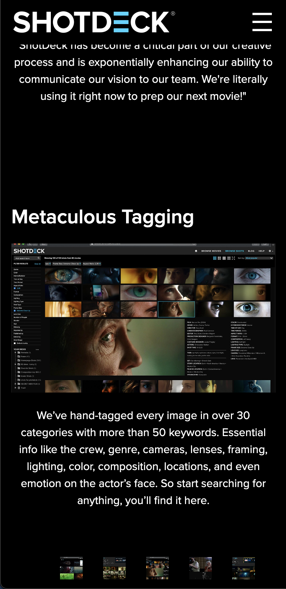
  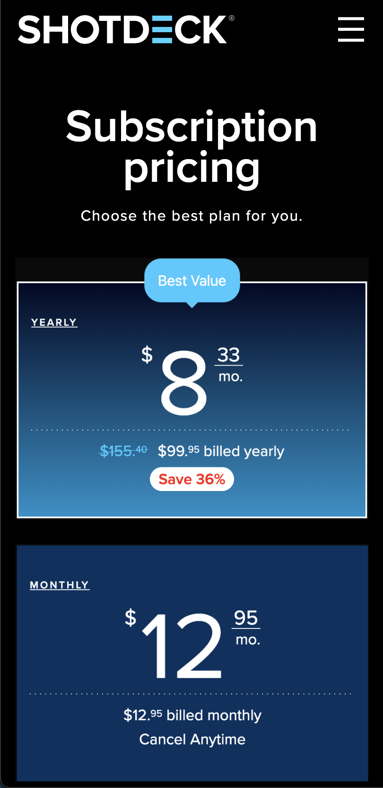

  ### Dit ging goed/Heb ik geleerd: 
  Ik heb geleerd hoe ik met HTML, CSS en Javascript een werkende website kan maken die toegankelijk is voor mensen met een beperking.
  Ik vind het waardevol om te weten hoe custom properties werken en hoe ik deze toe pas op mijn site.
  Het uitwerken van de carousel was het meest uitdagend en ik ben blij dat dit zonder javascript is gelukt. 

  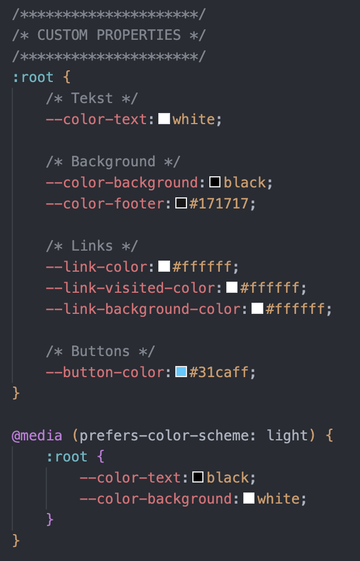

  ### Dit was lastig/Is niet gelukt:
  Ik vind het jammer dat ik het niet voor elkaar kreeg om mijn carousel navigatie in het midden van de pagina te centreren. 
  Alles dat ik heb geprobeerd werkte niet... 

  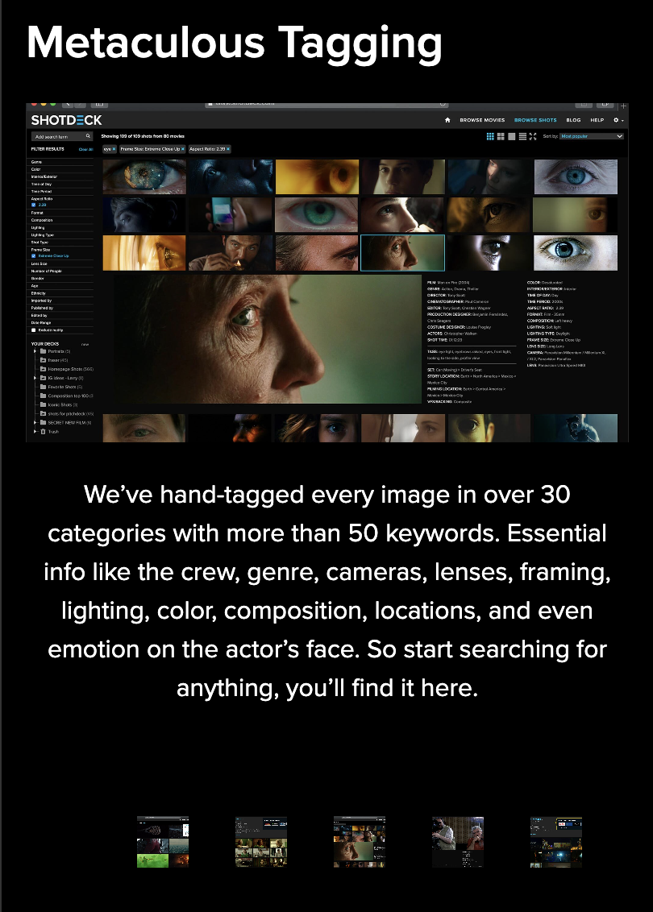

## Bronnenlijst

  
Dit zijn de bronnen die ik gebruikt hebt om informatie te verkrijgen

  1. https://www.w3schools.com/html/html_forms.asp
	2. https://developer.mozilla.org/en-US/docs/Web/CSS/aspect-ratio
	3. https://developer.mozilla.org/en-US/docs/Web/CSS/Using_CSS_custom_properties
	4. https://css-tricks.com/css-only-carousel/
	5. https://developer.mozilla.org/en-US/docs/Web/CSS/order
 

